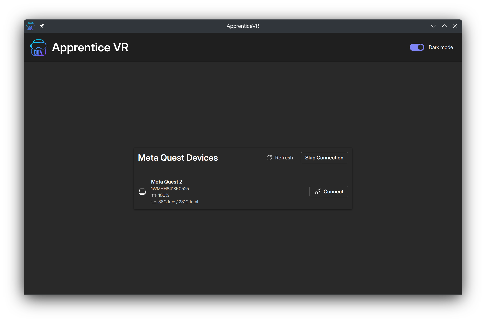
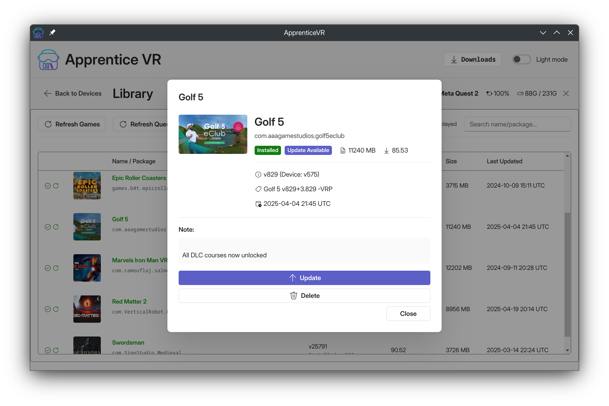
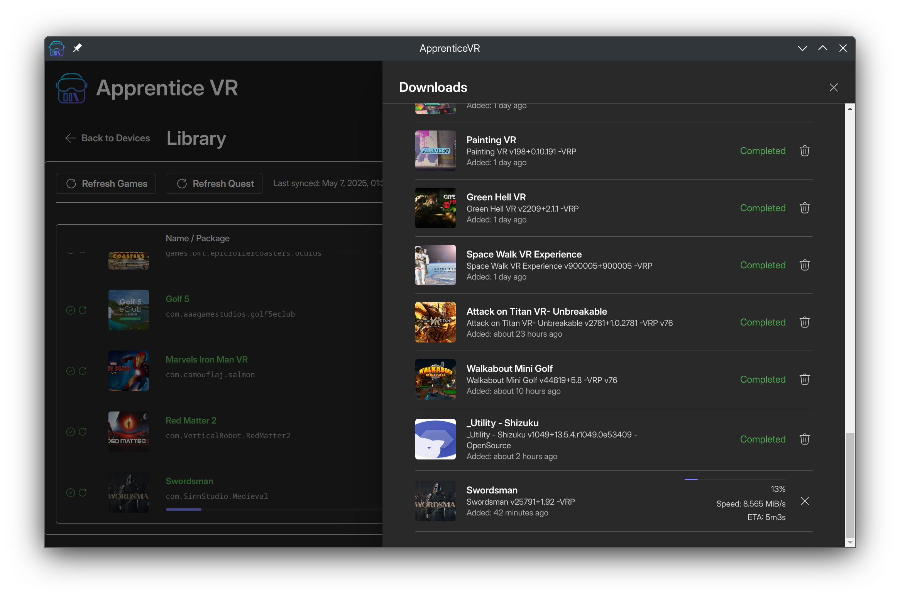

# ApprenticeVR

ApprenticeVR is a modern, cross-platform desktop application built with Electron, React, and TypeScript, designed for managing and sideloading content onto Meta Quest devices. It aims to provide a user-friendly and feature-rich alternative to existing sideloading tools.

## Inspiration

This project is heavily inspired by the fantastic work done on [Rookie Sideloader](https://github.com/VRPirates/rookie). ApprenticeVR seeks to build upon that foundation by offering a contemporary interface and experience across Windows, macOS, and Linux.

## Features

*   **Cross-Platform:** Works seamlessly on Windows, macOS, and Linux.
*   **Modern User Interface:** Built with Fluent UI and React for a clean and responsive experience.
*   **Device Management:**
    *   Automatically detect and list connected Meta Quest devices.
    *   Connect to and disconnect from devices.
    *   View device details such as model, ID, battery level, and storage information.
    *   Handles unauthorized and offline device states.
*   **Game Library Management:**
    *   Browse a comprehensive list of available games and applications.
    *   View game details including thumbnails, descriptions, versions, popularity, size, and last update date.
    *   Search and filter games by name, package ID, installation status, or available updates.
*   **Installation & Sideloading:**
    *   Download game files and OBBs.
    *   Install, uninstall, and update applications on your Quest device.
    *   Reinstall existing applications.
    *   Handle updates for installed applications.
*   **Download Management:**
    *   View and manage a queue of ongoing and completed downloads.
    *   Track download progress, extraction progress, and installation status.
    *   Cancel, retry, and delete downloaded files.
*   **Automatic Dependency Handling:** Manages required tools like ADB and rclone.
*   **Light & Dark Mode:** Adapts to your system's preferred theme.

## Screenshots

Here are some glimpses of ApprenticeVR in action:

**Device List (Dark Mode)**


**Game Library (Light Mode)**


**Game Details (Light Mode)**


**Downloads Manager (Dark Mode)**


## Recommended IDE Setup

- [VSCode](https://code.visualstudio.com/) + [ESLint](https://marketplace.visualstudio.com/items?itemName=dbaeumer.vscode-eslint) + [Prettier](https://marketplace.visualstudio.com/items?itemName=esbenp.prettier-vscode)

## Project Setup

### Prerequisites

*   [Node.js](https://nodejs.org/) (which includes npm)
*   [pnpm](https://pnpm.io/installation) (Recommended package manager)

### Install Dependencies

```bash
pnpm install
```

## Development

To run the application in development mode with hot-reloading:

```bash
pnpm dev
```

This will start the Electron application and open a development server for the React frontend.

## Building the Application

You can build the application for different platforms using the following commands:

```bash
# For Windows
pnpm build:win

# For macOS
pnpm build:mac

# For Linux
pnpm build:linux
```

Builds will be located in the `dist` or a platform-specific output directory.

## Linting and Formatting

To lint the codebase:
```bash
pnpm lint
```

To format the codebase with Prettier:
```bash
pnpm format
```

To perform type checking:
```bash
pnpm typecheck
```
